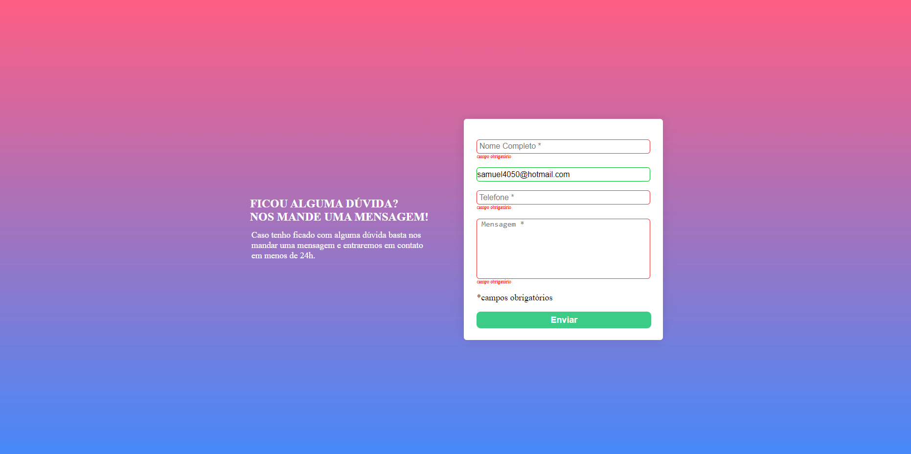

<h1>Desafio Formulário - DEV QUEST</h1>

<h2>Description</h2>
Project carried out using HTML, CSS and JS. Challenge proposed by the Dev-Quest course. 🧙🏻

<h2>Challenge proposed</h2>

<a>https://www.figma.com/design/zBKnYG9UNdUiIr8ClQTWSG/DESAFIO---HTML%2FCSS%2FJS-INTERMEDIÁRIO?node-id=1376-167&t=EXRk5Gvg2CWo0UFi-0</a>

<h2>My Home Page preview</h2>

<h2>Author</h2>

Samuel Coelho Modesto

GitHub: @samuelrabbit